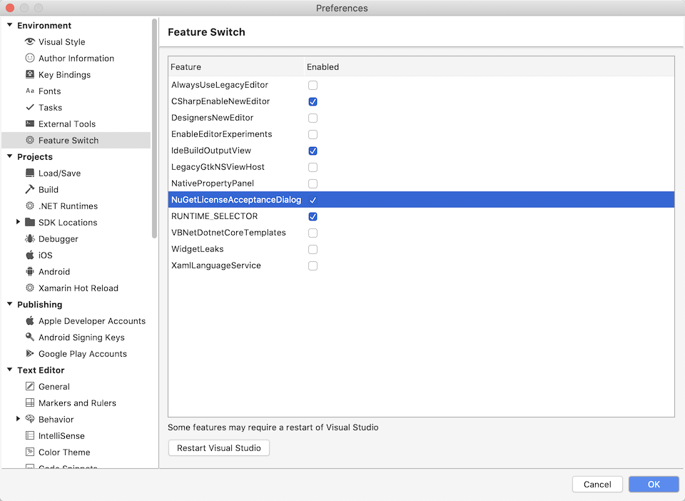

# Feature Switch configuration for MonoDevelop and Visual Studio for Mac

Allows features to be enabled/disabled. Keeps a list of features that the IDE
can enable/disable using the FeatureSwitchServer. These features can be enabled/disabled
in Preferences - Environment - Feature Switch

